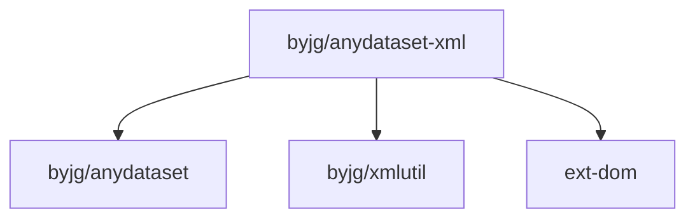

# AnyDataset-Xml

[](https://github.com/byjg/php-anydataset-xml/actions/workflows/phpunit.yml) 
[](http://opensource.byjg.com) 
[](https://github.com/byjg/php-anydataset-xml/) 
[](https://opensource.byjg.com/opensource/licensing.html) 
[](https://github.com/byjg/php-anydataset-xml/releases/)

XML abstraction dataset. Anydataset is an agnostic data source abstraction layer in PHP. 

See more about Anydataset [here](https://opensource.byjg.com/php/anydataset).

## Examples

### Simple Manipulation

example1.xml
```xml
<?xml version="1.0" encoding="UTF-8"?>
<bookstore>
    <book category="COOKING">
        <title lang="en-US">Everyday Italian</title>
        <author>Giada De Laurentiis</author>
        <year>2005</year>
        <price>30.00</price>
    </book>
    <book category="CHILDREN">
        <title lang="de-DE">Harry Potter</title>
        <author>J K. Rowling</author>
        <year>2005</year>
        <price>29.99</price>
    </book>
    <book category="WEB">
        <title lang="pt-BR">Learning XML</title>
        <author>Erik T. Ray</author>
        <year>2003</year>
        <price>39.95</price>
    </book>
</bookstore>
```

example1.php
```php
<?php
$xml = file_get_contents('example1.xml');

$dataset = new \ByJG\AnyDataset\Xml\XmlDataset(
    $xml,        // The Xml
    "book",       // The node that represents a row
    [
        "category" => "@category",
        "title" => "title",
        "lang" => "title/@lang",
        "lang2" => function ($row) {
            return substr($row->get('lang'), 0, 2);
        }
    ] // Mapping columns
);

$iterator = $dataset->getIterator();
foreach ($iterator as $row) {
    echo $row->get('category'); // Print COOKING, CHILDREN, WEB
    echo $row->get('title');    // Print Everyday Italian, Harry Potter, Learning Xml
    echo $row->get('lang');     // Print en-US, de-DE, pt-BR
    echo $row->get('lang2');    // Print en, de, pt
}
```

### Xml with namespaces

example2.xml
```xml
<?xml version="1.0" encoding="UTF-8"?>
<feed xmlns="http://www.w3.org/2005/Atom" xmlns:batch="http://schemas.google.com/gdata/batch" xmlns:gContact="http://schemas.google.com/contact/2008" xmlns:gd="http://schemas.google.com/g/2005" xmlns:openSearch="http://a9.com/-/spec/opensearchrss/1.0/">
    <id>myId</id>
    <updated>2014-09-15T19:35:55.795Z</updated>
    <category scheme="http://schemas.google.com/g/2005#kind" term="gContact#contact"/>
    <title type="text">Title</title>
    <link rel="alternate" type="text/html" href="https://www.google.com/"/>
    <link rel="http://schemas.google.com/g/2005#feed" type="application/atom+xml" href="https://www.google.com/m8/feeds/contacts/my%40gmail.com/full"/>
    <link rel="http://schemas.google.com/g/2005#post" type="application/atom+xml" href="https://www.google.com/m8/feeds/contacts/my%40gmail.com/full"/>
    <link rel="http://schemas.google.com/g/2005#batch" type="application/atom+xml" href="https://www.google.com/m8/feeds/contacts/my%40gmail.com/full/batch"/>
    <link rel="self" type="application/atom+xml" href="https://www.google.com/m8/feeds/contacts/my%40gmail.com/full?max-results=20"/>
    <link rel="next" type="application/atom+xml" href="https://www.google.com/m8/feeds/contacts/my%40gmail.com/full?max-results=20&amp;start-index=21"/>
    <author>
        <name>My Name</name>
        <email>My Email</email>
    </author>
    <generator version="1.0" uri="http://www.google.com/m8/feeds">Contacts</generator>
    <openSearch:totalResults>2107</openSearch:totalResults>
    <openSearch:startIndex>1</openSearch:startIndex>
    <openSearch:itemsPerPage>20</openSearch:itemsPerPage>
    <entry>
        <id>http://www.google.com/m8/feeds/contacts/my%40gmail.com/base/0</id>
        <updated>2013-10-05T22:16:03.564Z</updated>
        <category scheme="http://schemas.google.com/g/2005#kind" term="gContact#contact"/>
        <title type="text">Person 1</title>
        <link rel="http://schemas.google.com/contacts/2008/rel#edit-photo" type="image/*" href="https://www.google.com/m8/feeds/photos/media/my%40gmail.com/1/ABCDE"/>
        <link rel="http://schemas.google.com/contacts/2008/rel#photo" type="image/*" href="https://www.google.com/m8/feeds/photos/media/my%40gmail.com/1"/>
        <link rel="self" type="application/atom+xml" href="https://www.google.com/m8/feeds/contacts/my%40gmail.com/full/0"/>
        <link rel="edit" type="application/atom+xml" href="https://www.google.com/m8/feeds/contacts/my%40gmail.com/full/0/1234"/>
        <gd:email rel="http://schemas.google.com/g/2005#other" address="p1@gmail.com" primary="true"/>
    </entry>
    <entry>
        <id>http://www.google.com/m8/feeds/contacts/my%40gmail.com/base/1</id>
        <updated>2012-07-12T17:19:17.546Z</updated>
        <category scheme="http://schemas.google.com/g/2005#kind" term="http://schemas.google.com/contact/2008#contact"/>
        <title type="text">Person 2</title>
        <link rel="http://schemas.google.com/contacts/2008/rel#edit-photo" type="image/*" href="https://www.google.com/m8/feeds/photos/media/my%40gmail.com/1/EDFGH"/>
        <link rel="http://schemas.google.com/contacts/2008/rel#photo" type="image/*" href="https://www.google.com/m8/feeds/photos/media/my%40gmail.com/1"/>
        <link rel="self" type="application/atom+xml" href="https://www.google.com/m8/feeds/contacts/my%40gmail.com/full/1"/>
        <link rel="edit" type="application/atom+xml" href="https://www.google.com/m8/feeds/contacts/my%40gmail.com/full/1/5678"/>
        <gd:email rel="http://schemas.google.com/g/2005#other" address="p2@gmail.com" primary="true"/>
    </entry></feed>
```

example2.php
```php
<?php
$xml = file_get_contents('example2.xml')

$namespace = array(
    "fake" => "http://www.w3.org/2005/Atom",
    "gd" => "http://schemas.google.com/g/2005"
);

$rootNode = 'fake:entry';
$colNode = array("id" => "fake:id", "updated" => "fake:updated", "name" => "fake:title", "email" => "gd:email/@address");
$xmlDataset = new \ByJG\AnyDataset\Xml\XmlDataset(
    $xml,
    $rootNode,
    $colNode,
    $namespace
);
$xmlIterator = $xmlDataset->getIterator();
```

## Install

```
composer require "byjg/anydataset-xml"
```

## Running the Unit tests

```bash
vendor/bin/phpunit
```

## Dependencies


----
[Open source ByJG](http://opensource.byjg.com)
